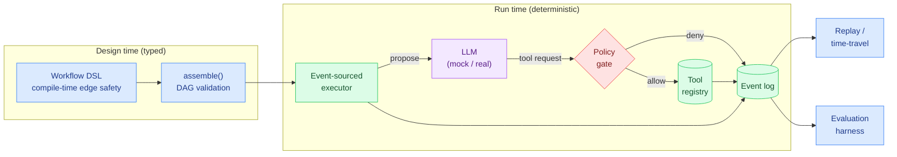
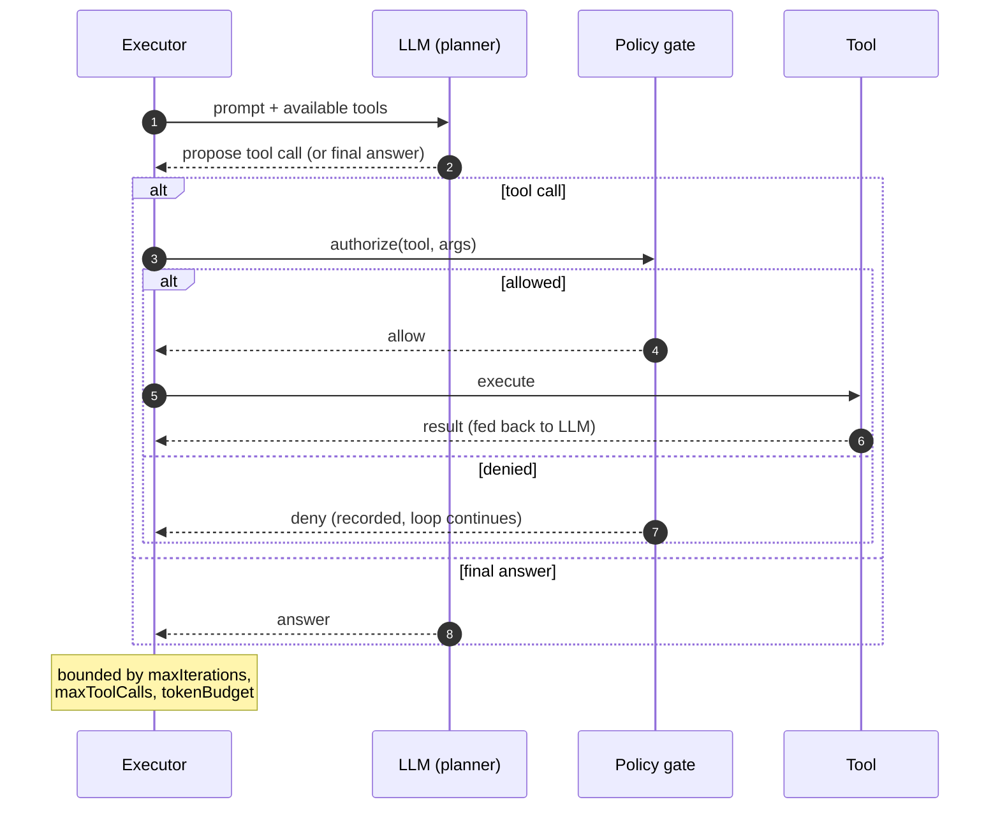

# AgentCanvas

**▶ Live demo: https://parag-labs.github.io/agent-canvas/** — runs entirely in your browser
(the engine is pure, deterministic TypeScript, so the whole demo is client-side; no backend,
no API key).

A visual, type-safe platform for **designing, running, debugging, and evaluating AI-agent
workflows**. You wire up a workflow as a graph — inputs, agents, tools, conditions, human
approvals, evaluators — watch it execute step by step, scrub back and forth through its
history, and measure it against a scored eval set.

The whole point is the split of responsibility that keeps an agent honest:

> **The LLM reasons and proposes. Deterministic code validates and executes.**

An agent node can *ask* to call any tool it likes. Whether that call actually happens is
decided by a policy gate and the workflow's static permissions — not by the model's
output. That boundary is the product, and it's the part that is tested hardest.

---

## The problem

Most "agent framework" demos hand the model the keys: it emits a tool call and the
runtime runs it. That's fine until the model is wrong, or the input is adversarial, and
the agent deletes the database because a comment in the ticket told it to.

AgentCanvas treats the model as an untrusted planner:

- Every tool call is authorized by a **deterministic policy gate** before it runs.
- Tools are only available if the workflow granted them at design time.
- Dangerous tools are denied even when the model explicitly requests them.
- Every step is an immutable event, so a run is fully reconstructable and replayable.

## Demo

```bash
pnpm install
pnpm dev          # open http://localhost:3000
```

Pick one of the example workflows (Research, Triage, Over-permissioned), give it an
input, and hit run. The canvas shows the graph; the panel shows each event as it happens
— agent reasoning, tool requests, policy decisions, evaluator scores.

To see the eval numbers below reproduced on your machine:

```bash
pnpm eval
```

## How it works



A workflow is compiled by a typed builder that only lets you connect nodes that actually
exist, then validated at runtime (unique names, exactly one input, acyclic). The executor
walks the DAG, and whenever an agent proposes a tool call it goes through the policy gate
before anything runs. Every decision is appended to an event log, which is what powers
both replay and evaluation.

### Agent loop



## TypeScript design

This repo leans on the type system to make invalid workflows unrepresentable:

- **Branded IDs** (`NodeId`, `RunId`, …) so you can't pass a run id where a node id is
  expected.
- **Discriminated-union node types** keyed on `kind`, with `assertNever` exhaustiveness so
  adding a node type is a compile error until every switch handles it.
- **A builder whose type parameter widens as you `.add()` nodes**, so `.connect(from, to)`
  only accepts names that have actually been declared — dangling edges are a *compile*
  error, not a runtime surprise.
- **Zod at the trust boundary**: `parseWorkflow()` validates untrusted JSON before it ever
  reaches the typed core, so external input can't smuggle in a malformed graph.

## Security

The security model is the headline feature, so it gets its own doc:
[SECURITY.md](SECURITY.md). In short:

- Tools are **deny-by-default**. An agent only sees tools the workflow granted.
- The **policy gate** is deterministic and runs on every proposed call. Dangerous tools
  (e.g. `delete_database`) are refused even with an explicit approval, because the mock
  model is deliberately "trickable" and the test proves the *policy* — not the prompt —
  is what stops it.
- Runs are **bounded** (max iterations, max tool calls, token budget) so a confused or
  hostile agent can't loop forever or burn unbounded cost.
- Every action is an **append-only event**, giving a tamper-evident trail of exactly what
  was proposed, allowed, denied, and executed.

## Evaluation

Numbers below are produced by `pnpm eval` from actual runs — nothing here is hand-typed.
The harness compares an agent that has a tool available against the same agent with the
tool withheld:

| Metric         | with-tool | no-tool |
|----------------|-----------|---------|
| Correctness    | 100%      | 100%    |
| Tool accuracy  | 100%      | 0%      |
| Unsafe actions | 0         | 0       |
| Avg latency    | 140ms     | 120ms   |
| Avg cost       | $0.0001   | $0.0000 |
| Avg tokens     | 28        | 16      |

The interesting column is **tool accuracy**: the deterministic engine correctly uses the
tool when it's available (100%) and correctly does not when it isn't (0%), with **zero
unsafe actions** in both cases.

## Local setup

Requirements: Node 20+ and pnpm 9+.

```bash
pnpm install
pnpm dev          # dev server on :3000
pnpm test         # run the engine test suite
pnpm typecheck    # tsc --noEmit
pnpm lint         # eslint
pnpm eval         # print the eval table above
pnpm build        # production build
```

No API keys are needed — the default LLM is a deterministic mock (see `.env.example`).

## Docker

```bash
docker compose up --build   # http://localhost:3000
```

The image builds the Next.js app and runs it in production mode. It needs no secrets.

## Testing

The engine core is covered by Vitest — 26 tests across the workflow DSL, executor, replay,
evaluation, tools, and the security policy:

```bash
pnpm test
```

The security suite is the one worth reading: it drives an injected, adversarial input at
an *over-permissioned* workflow and asserts the dangerous tool is still never executed.

## Roadmap

- Persist runs (currently in-memory) so history survives a restart.
- A real streaming provider adapter behind the existing `LLM` interface.
- Export/import workflows as shareable JSON via the `parseWorkflow()` boundary.
- Cost/latency budgets configurable per node in the UI.

## Layout

```
agent-canvas/
├── src/
│   ├── engine/                 # deterministic core (framework-free, unit-tested)
│   │   ├── ids.ts              # branded id types
│   │   ├── nodes.ts            # node discriminated union + Zod schema
│   │   ├── workflow.ts         # typed builder DSL + assemble/validate + parseWorkflow
│   │   ├── events.ts           # event types + append-only EventLog
│   │   ├── tools.ts            # tool registry + permissions
│   │   ├── llm.ts              # LLM abstraction (MockLLM / ScriptedLLM)
│   │   ├── policy.ts           # deterministic authorization gate
│   │   ├── executor.ts         # event-sourced execution + bounded agent loop
│   │   ├── replay.ts           # time-travel over the event log
│   │   ├── evaluate.ts         # scored evaluation harness
│   │   ├── examples.ts         # example workflows (shared by tests/UI/eval)
│   │   ├── eval-cli.ts         # `pnpm eval` entry point
│   │   └── __tests__/          # 26 Vitest tests
│   ├── app/                    # Next.js app router (UI shell)
│   └── components/Canvas.tsx   # React Flow visualization
├── ARCHITECTURE.md
├── SECURITY.md
├── CONTRIBUTING.md
├── CHANGELOG.md
├── Dockerfile
└── docker-compose.yml
```

## License

MIT — see [LICENSE](LICENSE).
